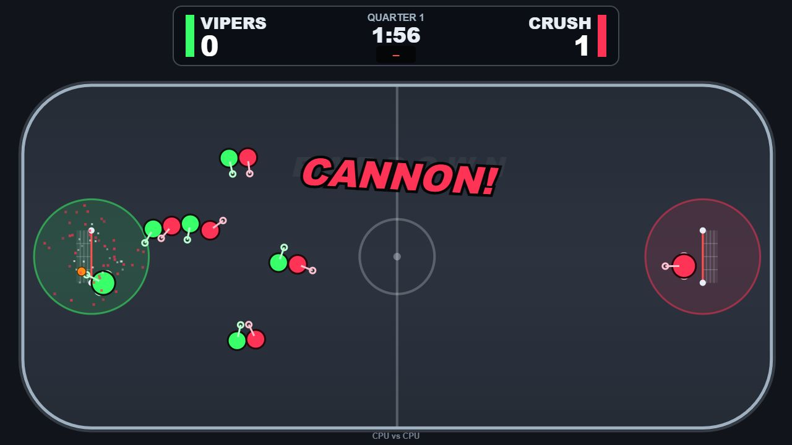

# BARDOWN — Arcade Box Lacrosse

NFL Blitz meets box lacrosse. 5v5 plus goalies, 30-second shot clock, hit anyone anytime, ON FIRE mode, desperation comebacks, dive shots, and goals in off the iron. Low-poly 3D arena with procedurally-built players (Three.js), zero art assets, all sound synthesized in Web Audio. Add `?classic=1` for the original 2D view.

**▶ Play: https://5lax.github.io/bardown/**

## Controls

WASD + mouse + spacebar. That's the game. Everyone is always in turbo.

| Action | Keyboard / Mouse | Gamepad |
|---|---|---|
| Attack the far net / run around | W / ASD | Left stick |
| Aim | Mouse | Right stick |
| Pass (tap) / switch on D | Left-click tap | A |
| Shoot (hold = power, release = fire) | Left-click hold | X |
| Check / hit | Right-click | B |
| Jump (hop checks) | SPACE | Y |
| Goalie takeover | hold G | LB |
| Pause / Mute | P / M | Start |

Specials: release a shot **mid-air** = jump shot, tap **right-click while charging** = behind-the-back / between-the-legs, release at **full sprint near the crease** = automatic dive shot. Shots in off the crossbar are BARDOWN goals.

## Run locally

Open `index.html` in any browser, or `PLAY.bat` (Windows), or `node tools/serve.js` → http://localhost:8347.

`?test=1&seed=N` runs CPU-vs-CPU. Headless playtest harness: `node tools/headless-test.js batch 6` (also `handicap 5` for comeback testing). Build log in [PROGRESS.md](PROGRESS.md), spec in [CLAUDE.md](CLAUDE.md).
